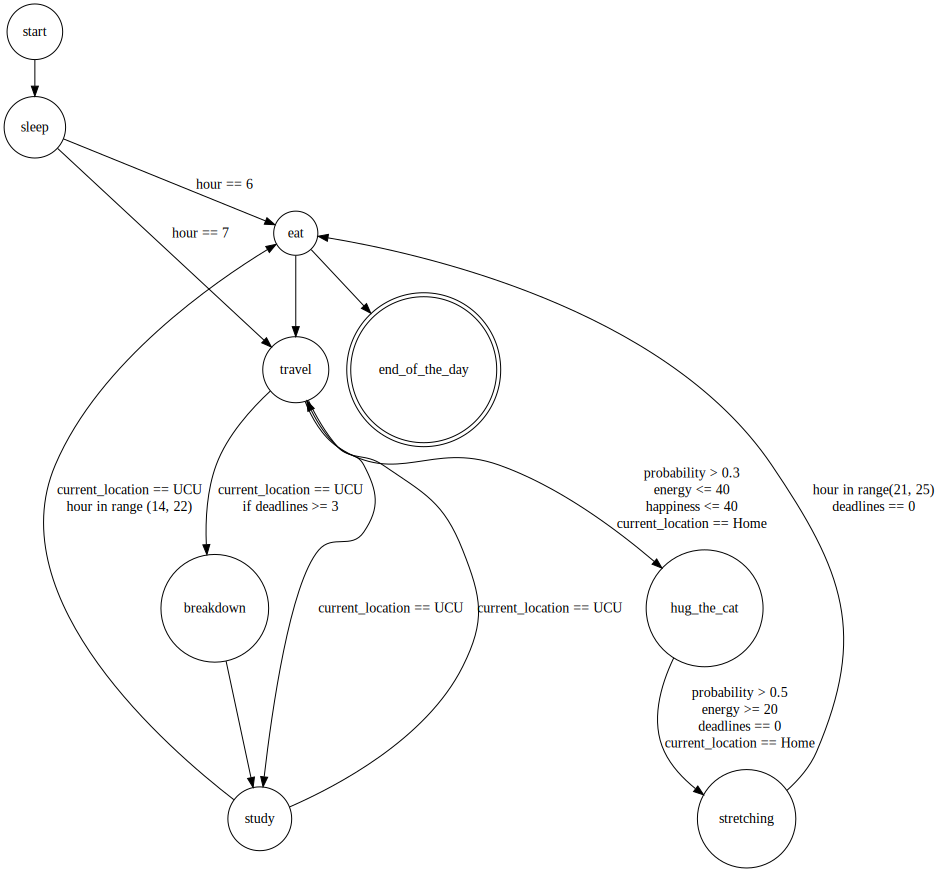

# FSM-daily-routine
This is a lab work for discrete math implementing finite state machines (FSM) with python.
For my machine I created 8 states:
- sleep
- eat
- breakdown
- hugging a cat
- rest
- study
- stretching
- travel

Moreover, all the events are put into an event queue. For that I used **arrayqueue.py** and **abstractcollection.py** to create  **event_queue**

There are 3 events which occur randomly, particularly stretching, hugging a cat and choosing the weekday at the beginning of the routine.

## Running the routine
You can simply run the module to start the daily routine. It is done with the code at the end of the module:

'''
routine = FSM()
student = Student(StateEnum.SLEEP)
routine.add_event(State(Student.start_the_day, student, 0))
routine.add_event(State(Student.eat, student, 30, 10))
routine.run_routine(student)
'''

## Example of output
6:00: Yay, I’m going to make it in time to the university! Even though I’m still exhausted…
7:00: Granola for breakfast was perfect, but it's so hard to start working...
9:00: I arrived at Ukrainian Catholic University
10:00: I don't think I can keep up with all the deadlines and studying, I'm desperate!
18:00: All the studying is done!
19:00: Finally, the last meal of the day!
21:00: I arrived at Home
22:00: There is nothing better to boost my mood than a fluffy 6 kilogram cat.
23:00: What a great time I had during the workout! Worn out, but definitely pleased.
24:00: This exhausting day has come to an end and I'm absolutely delighted to be in my warm and comfy bed.
-----------------------------
Finally, this long day has ended and by the end of the day my energy level had dropped to 20 and level of happiness is 70.

